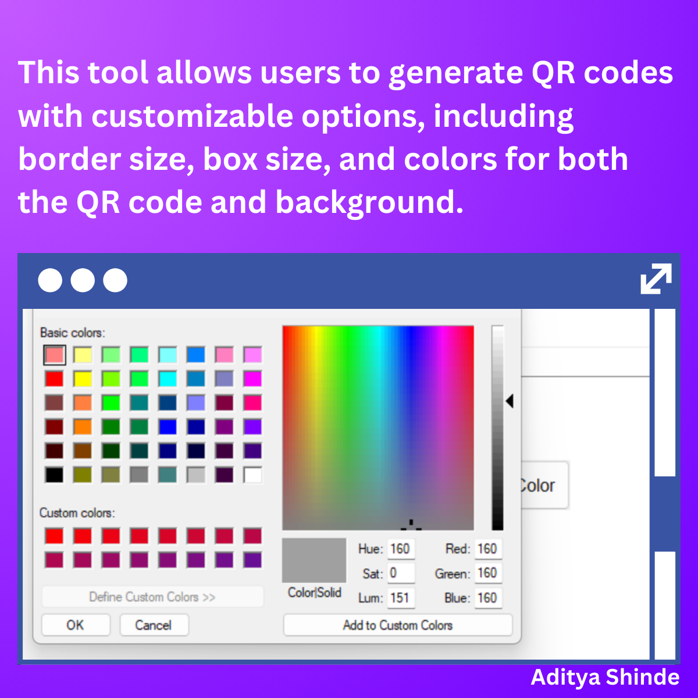

# Python QR Code Generator
 

 



A modern QR code generator application built with Python and Tkinter. This tool allows users to generate QR codes with customizable options, including border size, box size, and colors for both the QR code and background. Users can also choose where to save the generated QR code image.

## Features

- **Customizable QR Code**: Choose the color of the QR code and background.
- **Adjustable Sizes**: Modify the border size and box size of the QR code.
- **Responsive UI**: Modern and responsive design that adjusts to different window sizes.
- **Save QR Code**: Save the generated QR code to a desired location with a custom filename.

## Requirements

- Python 3.x
- `qrcode` library
- `Pillow` (PIL) library
- `tkinter` library (comes with Python standard library)

## Installation

To install the required libraries, you can use `pip`. Run the following command in your terminal:

```bash
pip install qrcode[pil] pillow

```
## Author 
Aditya Shinde 
